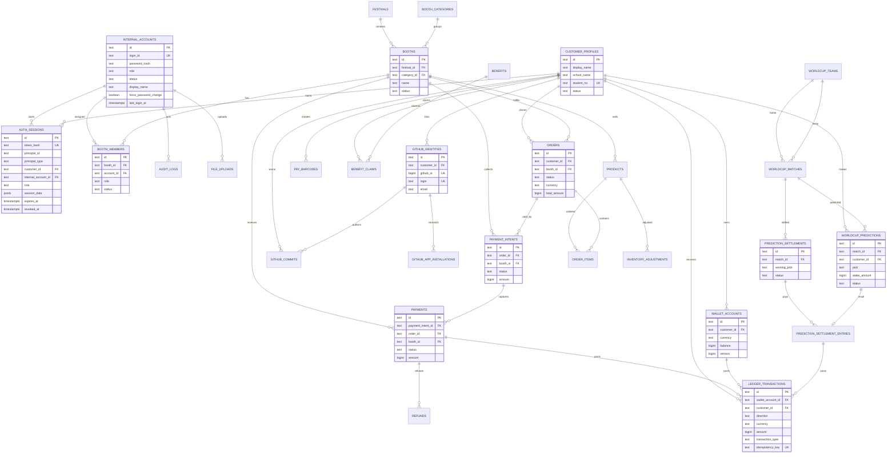

# Daema Coin Backend ERD

작성일: 2026-06-25

이 ERD는 프로덕션 최종 스키마다. 애플리케이션 읽기/쓰기 경로는 도메인별 PostgreSQL 테이블을 사용하고, 범용 JSONB 저장소에 의존하지 않는다.

## 핵심 원칙

- 고객 인증은 GitHub OAuth identity로 관리한다.
- 관리자와 부스 계정은 내부 계정으로 관리한다.
- 부스 계정은 관리자가 발급하며, `booth_members`로 접근 가능한 부스를 제한한다.
- 지갑 잔액은 `wallet_accounts`에 보관하고, 모든 변경은 append-only `ledger_transactions`로 남긴다.
- 결제, 예측 참여, 예측 정산, 관리자 조정은 idempotency key와 트랜잭션으로 중복 처리를 막는다.
- OAuth 직후 아직 학생 프로필이 없는 고객 세션은 `auth_sessions.principal_id`로 보존하고, 프로필 FK는 연결 가능한 경우에만 채운다.
- 원본 세션 토큰은 저장하지 않고 해시만 저장한다. 로그아웃/만료 처리는 `auth_sessions.revoked_at`과 `expires_at`으로 판단한다.
- 감사가 필요한 관리자/부스 작업은 `audit_logs`에 남긴다.

## Mermaid ERD

## 마이그레이션 순서

1. 정규 테이블과 `schema_migrations`를 생성한다.
2. 기존 레거시 JSONB 데이터가 있는 운영 DB는 `0002_backfill_legacy_resources_to_core_schema.sql`로 정규 테이블에 전량 백필한다.
3. 지갑 잔액은 `wallet_accounts.balance`와 `ledger_transactions` 합계를 대조한다.
4. 애플리케이션 읽기/쓰기 경로를 정규 테이블 repository로 전환한다.
5. cutover 검증 후 최종 스키마에 레거시 JSONB 저장소가 남아 있지 않은지 확인한다.

cutover 전 검증 쿼리는 `docs/database-cutover-checks.sql`을 사용한다.
